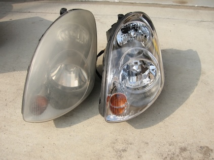

## What is Autoxidation (Peroxidation)?

The free radical reaction of molecular oxygen with weak C–H bonds that leads to hydroperoxides (ROOH), known as autoxidation to chemists and peroxidation to biochemists, is the key reaction that leads to oxidative degradation of hydrocarbon-rich materials. For example, autoxidation causes the surfaces of clear plastic materials to become ‘cloudy’ over time due to exposure to UV light and oxygen in air (image below).

Autoxidation is a radical chain reaction. Carbon-centered radicals (R•) rapidly react with molecular oxygen to form a peroxyl radical (R-OO•). Peroxyl radical is capable of removing a hydrogen atom from a susceptible organic molecule to
form organic hydroperoxide (R-OOH) and regenerate the carbon-centered radical (R•).

Peroxidation can be inhibited by providing a competitive substrate (antioxidant) that breaks the chain process. Knowledge of rate constants of autoxidation is key in development of antioxidants, molecules that trap the chain-propagating peroxyl radical and inhibit or terminate autoxidation.

### Peroxyl Radical Clocks

Use of peroxyl radical clocks is one of the leading experimental approaches used in determination of rate constants of H-atom transfer from substrate to peroxyl radical. Current peroxyl radical cloc`ks rely exclusively on chromatography-based analytical tools where resolution of analytes depends on many instrument-dependent factors (adsorbent, mobile phase, detector, analyte volatility, UV absorption, etc.). In recent years quantitative NMR (qNMR) spectroscopy has emerged as an attractive analytical method due to the fact that it is simple to adopt and is non-destructive to the sample. The aim of this project is to develop a peroxyl radical clock method that uses quantitative heteronuclear NMR for compound analysis.

Go back to [Research Projects][projects] page

[projects]: /research/